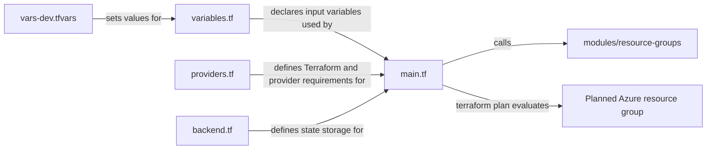

# Introduction

**Please ensure you have read the README.md for this Terraform module before starting these tasks.**

Your team is planning to build a greenfield Azure AVD estate, and you have been tasked with delivering the initial proof of concept. Another engineer made a basic start on the code, but then moved to a different piece of work, and you have now taken it over.

The current codebase provides:

1. `backend.tf` - configures Terraform to store state locally.
2. `providers.tf` - sets the required Terraform version to v1.0.0 or above and ensures that the AzureRM provider is available.
3. `modules/` - stores modules for reusable code. At present, there is only **one** module: `resource-groups`.
    1. There are many ways to use modules in Terraform. In this module, they are organised by resource type.
    2. In other environments, modules might instead represent a specific part of a platform.
4. `main.tf` - currently calls only the `resource-groups` module. Main Terraform files typically call modules and pass in the required variables.
    1. In particularly large estates, this may be split further, for example by using separate `main.tf` files for different parts of a platform.
5. `variables.tf` - defines the variable `name`, `description`, and `type` (for example, `string` or `bool`).
6. `vars-dev.tfvars` and `vars-prod.tfvars` - set the values for those variables.
    1. `variables.tf` is essential for `.tfvars` files to work correctly. It can feel like an extra step at first, but it is a core part of Terraform workflows.

## Tasks

To begin the proof of concept, the basic infrastructure needs to be defined and prepared. This work should focus on the dev environment.

1. A `resource-groups` module has already been created. The location defaults to UK South, so if that is acceptable, you do not need to declare it when calling the module. However, you do still need to declare the resource group name.
    1. In the root `main.tf` file, review how the module is called. `rg_name = var.rg_name` is defined in the relevant `.tfvars` file. Because this task focuses on dev, open `vars-dev.tfvars` and replace `[name]` with your actual name.
2. Inspect `variables.tf` in the root folder. Review how the variable is defined and described. This ensures Terraform expects a string value, which is useful for validation and consistency.
3. To confirm that the configuration behaves as expected, run the following commands in the terminal:
    1. `az login --scope https://management.core.windows.net//.default`
        This will prompt you to sign in to a valid Azure tenant and subscription. **Do not use a production environment.**
    2. `terraform init`
        This initialises Terraform using the providers and versions defined in the code. If those settings change later, run `terraform init --reconfigure`.
    3. `terraform plan`
        This shows what Terraform would create if applied. At this stage, it should show only the resource group created through the module.

## Learning outcomes

By reading through the code, seeing how the files interact, and updating a `.tfvars` file, you should now have a clearer understanding of basic Terraform structure, variable handling, and the plan workflow.

The diagram below shows how the main files interact during this task:

